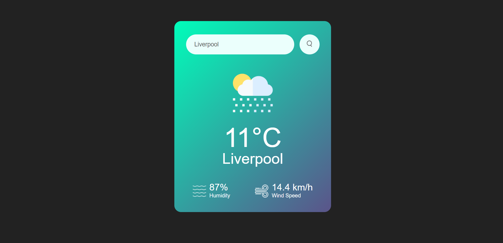
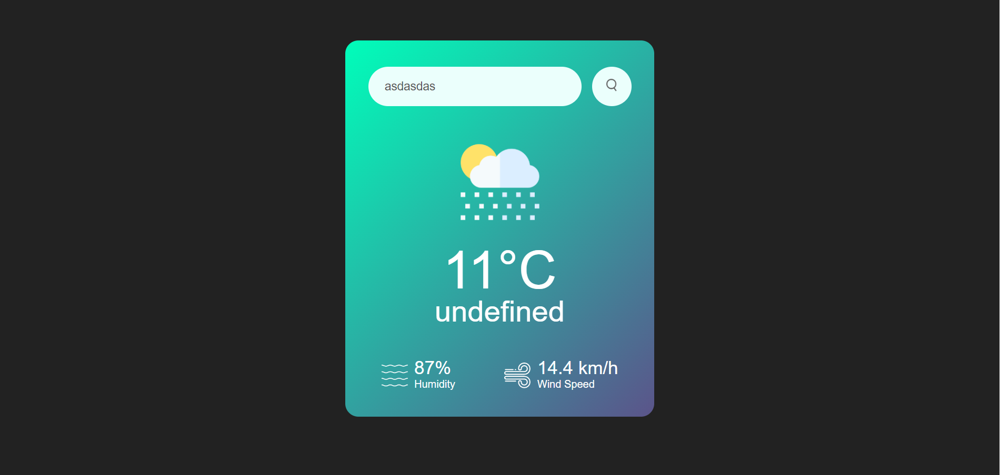

# Weather App

A simple weather application using HTML, CSS, and JavaScript to display real-time weather information.


## Introduction

This Weather App allows users to check the current weather conditions of a specific city. It utilizes the OpenWeatherMap API to fetch real-time weather data.

## Features

- Display temperature, city name, humidity, and wind speed.
- Dynamic weather icons based on the current weather condition.
- Simple and responsive design.

## Usage

1. Enter the desired city name in the input field.
2. Click the search button to fetch and display the weather information.

## Installation

Clone the repository to your local machine:

```bash
git clone https://github.com/your-username/weather-app.git
```

## API Key

To use the OpenWeatherMap API, you need to obtain an API key. Replace YOUR_API_KEY in the JavaScript code with your actual API key.

```bash
const apiKey = "YOUR_API_KEY";
const apiUrl = "https://api.openweathermap.org/data/2.5/weather?units=metric&q=";
```

## Screenshot




